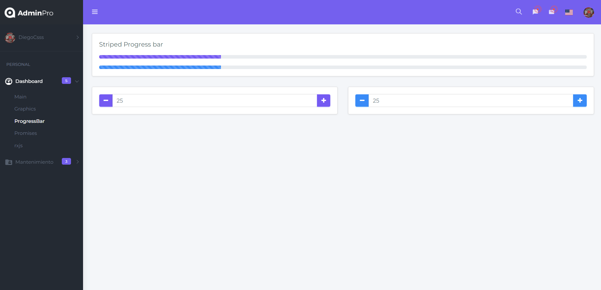

# Admin Panel

Welcome to the repository of the frontend for Fernando Herrera's Advanced Angular Course! In this project, I have made significant improvements to enhance the quality and functionality of the course.



## Key Features

- Redux: I have implemented Redux to improve state management in the application, enabling better organization and manipulation of data.
- Optimized folder structure: I have introduced a new folder structure following the principles of hexagonal architecture. This modularized organization allows for greater scalability and maintainability of the code.
- Native Charts.js: Instead of using ng2-charts, Charts.js is now used directly for handling charts. This offers greater flexibility and control over data visualizations.
- Proxy-based requests: I have configured the project to make requests through a proxy, facilitating development by avoiding CORS issues during local development.
- Technologies used: The project is developed using Angular 15, NGRX, Chart.js, HTML, and SASS.

## Proxy Configuration
The project uses a proxy to redirect requests to a remote server and avoid CORS issues during local development. Here's how you can configure the proxy:

1.In the root of the project, create a file named proxy.conf.json if it doesn't already exist.
2.Open the proxy.conf.json file and add the following content:

```json
{
  "/api": {
    "target": "http://remote-server.com",
    "secure": false,
    "changeOrigin": true,
    "logLevel": "debug"
  }
}
```

Make sure to replace http://remote-server.com with the URL of the remote server you want to redirect requests to.

Example

```json
{
  "/api": {
    "target": "http://localhost:3000",
    "secure": false
  }
}
```
the localhost or the url has to point to the backend made in the course and add the configuration in your ng serve --proxy-config proxy.conf.json (package.json)
```js
  "scripts": {
    "ng": "ng",
    "start": "ng serve --proxy-config proxy.conf.json",
    "build": "ng build",
    "watch": "ng build --watch --configuration development",
    "test": "ng test"
  },
```
## Usage Instructions
1. Clone the repository to your local machine.
2. Ensure that you have Node.js and npm installed on your system.
3. Navigate to the project directory and install the dependencies by running the following command:
~~~
npm install
ng serve 
~~~
4.Open your browser and visit http://localhost:4200 to see the application in action.
Enjoy the Advanced Angular Course, and please don't hesitate to contact me if you have any questions or suggestions!

## Usage Instructions
Contributions to the project are welcome! If you have any ideas to improve the project or encounter any issues, please open an issue or submit a pull request.

## License
This project is distributed under the MIT License.

Thank you for your interest in this repository! I hope this Advanced Angular Course helps you deepen your knowledge in Angular. If you have any questions, feel free to consult the documentation or reach out to me. Happy coding!
